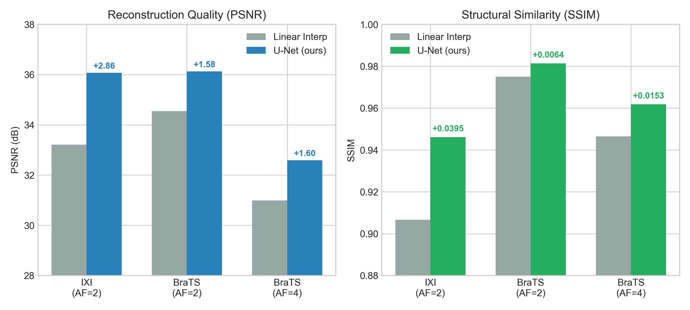
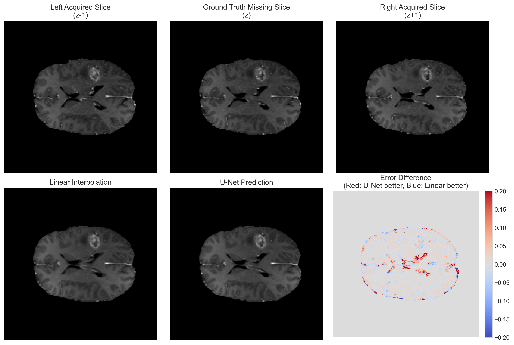

# MRI Slice Reconstruction with Deep Learning

> **One-line pitch:** MRI scanners are slow. What if you acquired only a fraction of the slices and used a U-Net to reconstruct the rest — at two different acceleration factors, on both healthy and tumour-bearing brains?

---

## The Problem

A full brain MRI scan acquires hundreds of axial slices sequentially. This takes time — and in clinical settings, scan time directly affects patient comfort, scanner availability, and cost.

One way to speed things up is to skip slices during acquisition and reconstruct the missing ones computationally. The challenge: can a neural network recover missing slices accurately enough that the reconstruction is clinically useful?

---

## The Idea

This project studies two acceleration settings:

**×2 acceleration** — one slice missing between each acquired pair:

```
Real scan (slow)          ×2 accelerated                  Reconstructed
─────────────────         ──────────────────────          ──────────────────────
slice z−1  ✓              slice z−1  ✓  acquired          slice z−1  ✓
slice z    ✓              slice z    ✗  missing      →    slice z    ← U-Net
slice z+1  ✓              slice z+1  ✓  acquired          slice z+1  ✓
```

**×4 acceleration** — three consecutive slices missing between each acquired pair:

```
slice z    ✓  acquired
slice z+1  ✗  missing  → U-Net predicts at t=0.25
slice z+2  ✗  missing  → U-Net predicts at t=0.50
slice z+3  ✗  missing  → U-Net predicts at t=0.75
slice z+4  ✓  acquired
```

For ×4, a positional channel *t* ∈ {0.25, 0.50, 0.75} is added as a third input channel so the model knows which of the three missing slices it is predicting.

---

## What Was Built

```
Preprocessing
  src/preprocess.py                       IXI NIfTI → resize → normalise → 2.5D pairs
  src/preprocess_brats_reconstruction.py  BraTS AF=2, robust foreground normalisation
  src/preprocess_brats_af4.py             BraTS AF=4, 3-channel [left, right, t_map]

Training
  src/train.py                            U-Net + PlainCNN backbone (IXI)
  src/train_brats_volume_split.py         BraTS AF=2, patient-level split
  src/train_brats_af4.py                  BraTS AF=4, 3-channel U-Net

Evaluation
  src/compare_brats_stratified.py         AF=2 stratified by tumour / non-tumour
  src/compare_brats_af4.py                AF=4 stratified by tumour and position t
  src/analyze_brats_reconstruction.py     Per-slice tumour vs. healthy analysis
```

All configuration (paths, hyperparameters) lives in one place: `src/config.py`.

---

## Datasets

### IXI Brain Dataset
~600 T1-weighted brain MRI scans from healthy volunteers at three London hospitals (Guy's, Hammersmith, IOP). After quality filtering: **581 volumes → 42,816 input–target pairs** for ×2 reconstruction. Split 70 / 15 / 15 (train / val / test).

### BraTS2020
57,195 pre-extracted axial HDF5 slices from skull-stripped glioma volumes (T1ce channel).
- **AF=2**: 28,413 reconstruction pairs, patient-level split, tumour/non-tumour stratification
- **AF=4**: 3 missing slices per acquired pair with positional t-channel encoding

Because BraTS is skull-stripped (~70–80 % background zeros), raw PSNR is inflated. Results are also reported as **FG-MAE** (foreground MAE, pixels where ground truth > 0.02).

---

## The Model — U-Net

A U-Net encoder–decoder with skip connections at every resolution level.

```
Input: [left_slice, right_slice]         (2 × 256 × 256)  ←  AF=2
Input: [left_slice, right_slice, t_map]  (3 × 256 × 256)  ←  AF=4
          │
    ┌─────▼─────┐
    │  Encoder  │   32 → 64 → 128 → 256 channels
    │           │   2× Conv3×3 + BN + ReLU → MaxPool
    └─────┬─────┘
          │  ← skip connections (fine spatial detail preserved)
    ┌─────▼─────┐
    │ Bottleneck│   512 channels, 16 × 16 spatial resolution
    └─────┬─────┘
          │
    ┌─────▼─────┐
    │  Decoder  │   256 → 128 → 64 → 32 channels
    │           │   Upsample + concat skip + 2× Conv
    └─────┬─────┘
          ▼
Output: predicted missing slice          (1 × 256 × 256)
```

**7.76 M parameters.** Trained for up to 20 epochs on an RTX 5070 Ti.  
Loss = `0.8 × L1 + 0.2 × (1 − SSIM)` — pixel accuracy blended with structural similarity.  
Optimiser: Adam (lr = 1e-3, weight decay = 1e-5) with ReduceLROnPlateau.

---

## Results

### Reconstruction quality across all settings



The U-Net consistently outperforms linear interpolation. The SSIM gain is largest on IXI (healthy, diverse scanners, +0.0395) and the PSNR gain is consistent across all settings (+1.58 – +2.86 dB).

### IXI — ×2 Acceleration

| Method                  | PSNR (dB)       | SSIM               | MAE    |
|-------------------------|-----------------|--------------------|--------|
| Cubic spline            | 33.19           | 0.9048             | —      |
| Linear interpolation    | 33.21           | 0.9066             | —      |
| PlainCNN (no skips)     | 33.06           | —                  | —      |
| **U-Net (ours)**        | **36.07 ± 6.5** | **0.9461 ± 0.029** | 0.0093 |

> Above 35 dB: differences are barely visible to the human eye.

### BraTS — ×2 and ×4 Acceleration

| Setting | Method           | PSNR (dB)  | SSIM       | FG-MAE      |
|---------|------------------|------------|------------|-------------|
| AF=2    | Linear interp.   | 34.55      | 0.9747     | —           |
| AF=2    | **U-Net (ours)** | **36.13**  | **0.9811** | **0.00754** |
| AF=4    | Linear interp.   | 30.99      | 0.9461     | —           |
| AF=4    | **U-Net (ours)** | **32.59**  | **0.9614** | —           |

Stratified analysis confirms the model improves reconstruction on **both tumour-containing and non-tumour slices**. At AF=4, the largest SSIM gain occurs at *t* = 0.50 — the slice furthest from both acquired neighbours.

### Qualitative — Tumour-bearing BraTS slice (AF=2)



The error difference map (bottom right) shows U-Net achieves lower error (red) around the brain boundary, ventricles, and tumour edges. Blue regions where linear wins are sparse and small.

---

## Ablation — Skip Connections Are the Key Ingredient

A **PlainCNN** (same depth, identical convolutional blocks, no skip connections) scores **33.06 dB** — worse than linear interpolation at 33.21 dB. A deep network without skip connections cannot beat a classical baseline on this task. The U-Net's +3.01 dB gain over PlainCNN isolates the skip pathway as the essential architectural ingredient.

---

## Explainability

Four attribution methods applied to 50 uniformly sampled IXI test cases:

| Method                               | Key finding                                                        |
|--------------------------------------|--------------------------------------------------------------------|
| **Grad-CAM**                         | Scales with difficulty: hard → diffuse attention; easy → near-zero |
| **Integrated Gradients** (L/R 1.009) | Both input slices contribute symmetrically                         |
| **Channel ablation** (L/R 1.059)     | Model uses *global* slice structure, not local patches             |
| **Occlusion sensitivity** (L/R 1.028)| No single spatial region dominates                                 |
| **MC-Dropout variance**              | 4.09 × 10⁻⁶ — well-calibrated on in-distribution data             |

All three input-attribution methods give left/right ratios within ~6 % of unity, confirming genuine bidirectional interpolation.

---

## Project Structure

```
Project/
├── src/
│   ├── config.py                          # all paths + hyperparameters
│   ├── preprocess.py                      # IXI NIfTI → 2.5D pairs
│   ├── preprocess_brats_reconstruction.py # BraTS AF=2, robust normalisation
│   ├── preprocess_brats_af4.py            # BraTS AF=4, 3-channel [left, right, t_map]
│   ├── train.py                           # U-Net + PlainCNN backbone (IXI)
│   ├── train_brats_volume_split.py        # BraTS AF=2, patient-level split
│   ├── train_brats_af4.py                 # BraTS AF=4 training
│   ├── compare_brats_stratified.py        # AF=2 evaluation: tumour vs. non-tumour
│   ├── compare_brats_af4.py               # AF=4 evaluation: by tumour + position t
│   └── analyze_brats_reconstruction.py    # per-slice tumour/healthy analysis
├── Documentation/
│   ├── main.tex                           # NeurIPS-style project report
│   ├── report.tex                         # condensed 3-page version
│   └── references.bib
├── data/
│   ├── raw/                               # IXI .nii / .nii.gz files (git-ignored)
│   ├── brats/img/                         # BraTS2020 H5 slices (git-ignored)
│   └── processed/                         # generated .npy arrays (git-ignored)
├── models/                                # checkpoints .pth (git-ignored)
├── outputs/
│   ├── figures/                           # training curves, prediction grids
│   └── metrics/                           # per-sample metric arrays
├── notebooks/                             # exploratory Jupyter notebooks
├── logs/                                  # SLURM / training logs (git-ignored)
├── requirements.txt
└── job_run_gpu.sh                         # UBELIX HPC submission script
```

---

## Setup

```bash
pip install -r requirements.txt
```

Requirements: `torch`, `torchvision`, `pytorch-msssim`, `nibabel`, `numpy`, `scipy`, `scikit-image`, `matplotlib`, `h5py`.

---

## Running

All commands from the **project root**.

```bash
# ── IXI (×2 acceleration) ──────────────────────────────────────────────────
python -m src.preprocess
python -m src.train --model unet --data ixi
python -m src.train --model plaincnn --data ixi   # ablation

# ── BraTS AF=2 ─────────────────────────────────────────────────────────────
python -m src.preprocess_brats_reconstruction --brats-dir data/brats/img
python -m src.train_brats_volume_split
python -m src.compare_brats_stratified
python -m src.analyze_brats_reconstruction

# ── BraTS AF=4 ─────────────────────────────────────────────────────────────
python -m src.preprocess_brats_af4 --brats-dir data/brats/img
python -m src.train_brats_af4
python -m src.compare_brats_af4
```

### On UBELIX HPC

```bash
sbatch job_run_gpu.sh
```

Logs → `logs/<jobname>_<jobid>.out` and `.err`

---

## Configuration

Every tunable parameter lives in [`src/config.py`](src/config.py).

| Parameter             | Default              | What it controls                                  |
|-----------------------|----------------------|---------------------------------------------------|
| `TARGET_SIZE`         | `(256, 256)`         | Pixel resolution of each slice                    |
| `ACCELERATION_FACTOR` | `2`                  | Slices skipped per pair (2 = 50 % missing)        |
| `IN_CHANNELS`         | `3`                  | Input channels (2 for AF=2, 3 for AF=4 + t_map)  |
| `BATCH_SIZE`          | `8`                  | Samples per gradient step                         |
| `NUM_EPOCHS`          | `20`                 | Maximum training epochs                           |
| `LEARNING_RATE`       | `1e-3`               | Adam initial learning rate                        |
| `LOSS_ALPHA`          | `0.8`                | L1 vs SSIM blend (0.8 = 80 % L1, 20 % SSIM)      |
| `UNET_FEATURES`       | `[32, 64, 128, 256]` | Channel counts across U-Net encoder levels        |
| `TRAIN_SPLIT`         | `0.70`               | Fraction of volumes used for training             |
| `VAL_SPLIT`           | `0.15`               | Fraction used for validation                      |
| `RANDOM_SEED`         | `42`                 | Reproducibility seed                              |
